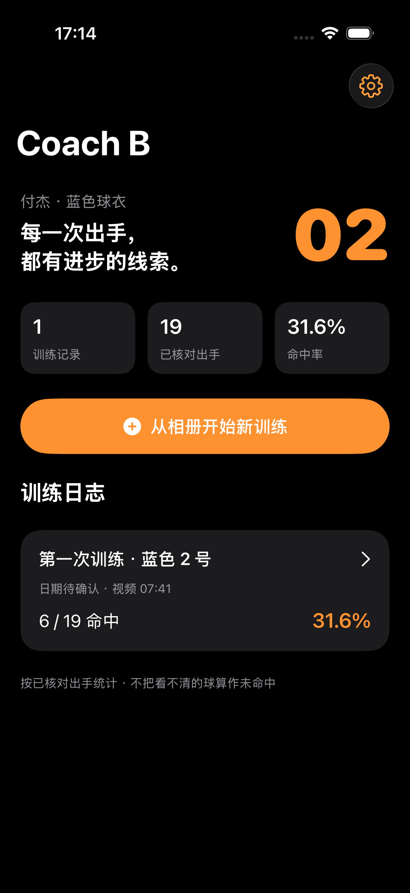
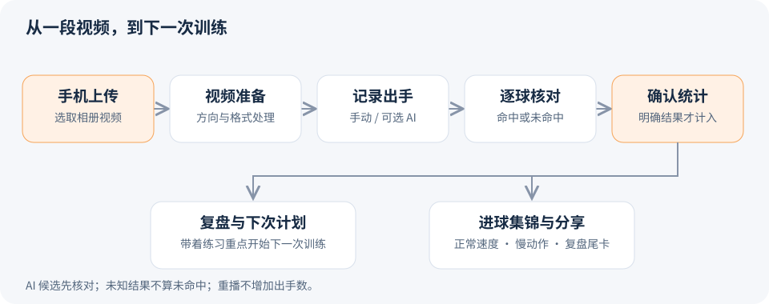
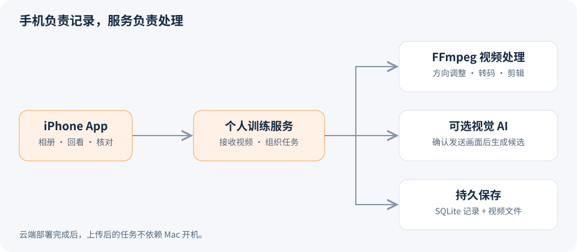

# Coach B — AI Basketball Coach

**记录每一次出手，让下一次训练更有方向。**

从手机相册里的训练视频出发，把逐球记录、命中率、进球集锦和训练复盘放在一起。Coach B 是你的个人篮球训练助手：回看表现、分享高光，再带着明确的练习重点走进下一次训练。

**iPhone · 训练记录 · 视频集锦 · AI 辅助核对**

[体验与安装](#体验与安装) · [使用流程](#使用流程) · [开发路线](ROADMAP.md) · [参与开发](CONTRIBUTING.md)

> **开发版 v0.1** · 已通过 iPhone 模拟器构建和后端流程测试。当前提供源码，尚未发布 App Store / TestFlight 安装包；AI 识别效果仍需真实视频验证。

## 应用截图

  

<b>训练首页</b> · 从相册开始，回到数据复盘

截图来自正在运行的 iPhone 模拟器开发版，统计来自人工核对记录，不是 AI 识别准确率演示。

## 用 Coach B 做什么

| 从哪里开始 | 你能得到什么 |
| --- | --- |
| **选一段训练视频** | 从 iPhone 相册上传，集中保存训练记录和可回看的片段。 |
| **核对每一次出手** | 确认命中、未命中与无法判断的球，得到有依据的命中率。 |
| **分享自己的高光** | 将已确认进球剪成正常速度＋精选慢动作集锦，并加入数据与复盘尾卡。 |
| **带着重点去训练** | 查看文字复盘和通用练习计划，为下一次训练留下记录。 |

AI 可以协助寻找候选投篮；手动补记、回看和修改始终可用。**看不清的球不会自动算成未命中，慢动作重播也不会重复计数。**

## 使用流程

**命中率 = 已核对命中数 ÷ 已核对且结果明确的出手数。** 没有确认记录时显示“暂无数据”，统计仅代表当前录像中已确认的投篮。

## 体验与安装

目前需要从源码运行开发版。手机端和视频处理服务都在这个仓库里：

1. **运行视频服务**：按[开发指南](docs/development.md)准备后端，或按[部署说明](docs/deployment.md)配置 HTTPS 云端服务。
2. **运行 iPhone App**：用 Xcode 打开 `ios/HoopJournal.xcodeproj`，选择模拟器；安装到真实 iPhone 需要配置自己的 Apple 签名。
3. **连接并开始训练**：在 App 设置填写服务地址与私人访问令牌，然后从相册选择视频。

服务部署到云端后，上传完成的分析与剪辑任务可独立处理，不需要 Mac 一直开着。当前模拟器连接本机开发服务，尚未完成公网部署与实机验证。

只有普通 Apple ID、暂时没有云服务器？先看[低成本使用方案](docs/cost-options.md)。

## 当前进度

| 已实现 | 接下来 |
| --- | --- |
| 相册入口、训练日志、逐球核对与统计 | 实际 iPhone 安装与云端部署 |
| 90° 方向调整、HDR 到 SDR 预览 | 后台上传、断点续传与完成通知 |
| 无声进球集锦、慢动作、复盘尾卡 | 背影开场、人物缩放与配乐 |
| 文字复盘与通用 60 分钟练习计划 | 分类趋势和更个性化的计划 |
| 可选 AI 候选识别接口 | 真实视频上的漏检、误判与费用评估 |

当前上传需要保持 App 前台；AI 服务需要单独配置，候选结果仍需人工核对。训练建议目前基于记录和规则模板，不将推测当作动作诊断。

完整迭代清单见 [Roadmap](ROADMAP.md)。

## 项目如何协作

- **手机端**：SwiftUI、系统相册选择、视频回看、核对与分享。
- **服务端**：Python、SQLite、FFmpeg；个人令牌鉴权，数据与媒体持久保存。
- **持续开发**：GitHub Actions 检查后端流程和 iPhone 构建；训练视频和密钥不放入代码仓库。

[开发指南](docs/development.md) · [部署说明](docs/deployment.md) · [产品规格](docs/mobile-mvp.md) · [贡献约定](CONTRIBUTING.md)
